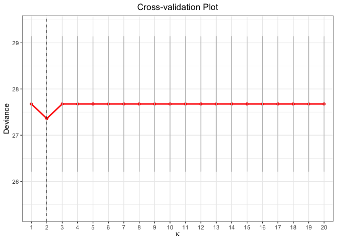

<!-- README.md is generated from README.Rmd. Please edit that file -->

# glmtlp

<!-- badges: start -->
<!-- badges: end -->

The goal of glmtlp is to fit generalized linear models with l0, l1 and
truncated lasso penalty with a fast procedure.

## Installation

You can install the released version of glmtlp from
[CRAN](https://CRAN.R-project.org) with:

``` r
install.packages("glmtlp")
```

## Examples for Gaussian Regression Models

The following are three examples which show you how to use `glmtlp` to
fit gaussian regression models:

``` r
library(glmtlp)
data("gau_data")
colnames(gau_data$X)[gau_data$beta != 0]
#> [1] "V1"  "V6"  "V10" "V15" "V20"
```

``` r
# Cross-Validation using TLP penalty
cv.fit <- cv.glmtlp(gau_data$X, gau_data$y, family = "gaussian", penalty = "tlp", ncores=2)
coef(cv.fit)[abs(coef(cv.fit)) > 0]
#>    intercept           V1           V6          V10          V15          V20 
#> -0.009692127  1.240201054  0.883169910  0.725706771  1.125980744  0.981390567
plot(cv.fit)
```


``` r
# Single Model Fit using TLP penalty
fit <- glmtlp(gau_data$X, gau_data$y, family = "gaussian", penalty = "tlp")
coef(fit, lambda = cv.fit$lambda.min)
#>    intercept           V1           V2           V3           V4           V5 
#> -0.009692127  1.240201054  0.000000000  0.000000000  0.000000000  0.000000000 
#>           V6           V7           V8           V9          V10          V11 
#>  0.883169910  0.000000000  0.000000000  0.000000000  0.725706771  0.000000000 
#>          V12          V13          V14          V15          V16          V17 
#>  0.000000000  0.000000000  0.000000000  1.125980744  0.000000000  0.000000000 
#>          V18          V19          V20 
#>  0.000000000  0.000000000  0.981390567
predict(fit, X = gau_data$X[1:5, ], lambda = cv.fit$lambda.min)
#> [1]  0.1906169  2.2279315 -1.4255560  0.9313560 -2.8151758
plot(fit, xvar = "log_lambda", label = TRUE)
```


``` r
# Cross-Validation using L0 penalty
cv.fit <- cv.glmtlp(gau_data$X, gau_data$y, family = "gaussian", penalty = "l0", ncores=2)
coef(cv.fit)[abs(coef(cv.fit)) > 0]
#>    intercept           V1           V6          V10          V15          V20 
#> -0.009687042  1.240319880  0.883378583  0.725607300  1.125958218  0.981544178
plot(cv.fit)
```


``` r
# Single Model Fit using L0 penalty
fit <- glmtlp(gau_data$X, gau_data$y, family = "gaussian", penalty = "l0")
coef(fit, kappa = cv.fit$kappa.min)
#>    intercept           V1           V2           V3           V4           V5 
#> -0.009687042  1.240319880  0.000000000  0.000000000  0.000000000  0.000000000 
#>           V6           V7           V8           V9          V10          V11 
#>  0.883378583  0.000000000  0.000000000  0.000000000  0.725607300  0.000000000 
#>          V12          V13          V14          V15          V16          V17 
#>  0.000000000  0.000000000  0.000000000  1.125958218  0.000000000  0.000000000 
#>          V18          V19          V20 
#>  0.000000000  0.000000000  0.981544178
predict(fit, X = gau_data$X[1:5, ], kappa = cv.fit$kappa.min)
#> [1]  0.190596  2.228306 -1.425994  0.931749 -2.815322
plot(fit, xvar = "kappa", label = TRUE)
```


``` r
# Cross-Validation using L1 penalty
cv.fit <- cv.glmtlp(gau_data$X, gau_data$y, family = "gaussian", penalty = "l1", ncores=2)
coef(cv.fit)[abs(coef(cv.fit)) > 0]
#>   intercept          V1          V4          V6         V10         V11 
#> -0.03589837  1.09063811 -0.03020625  0.70163818  0.56874685  0.04658280 
#>         V14         V15         V19         V20 
#>  0.01969490  0.96583003 -0.06633302  0.81279715
plot(cv.fit)
```


``` r
# Single Model Fit using L1 penalty
fit <- glmtlp(gau_data$X, gau_data$y, family = "gaussian", penalty = "l1")
coef(fit, lambda = cv.fit$lambda.min)
#>   intercept          V1          V2          V3          V4          V5 
#> -0.03589837  1.09063811  0.00000000  0.00000000 -0.03020625  0.00000000 
#>          V6          V7          V8          V9         V10         V11 
#>  0.70163818  0.00000000  0.00000000  0.00000000  0.56874685  0.04658280 
#>         V12         V13         V14         V15         V16         V17 
#>  0.00000000  0.00000000  0.01969490  0.96583003  0.00000000  0.00000000 
#>         V18         V19         V20 
#>  0.00000000 -0.06633302  0.81279715
predict(fit, X = gau_data$X[1:5, ], lambda = cv.fit$lambda.min)
#> [1]  0.03978789  1.83217872 -0.97812631  0.54083363 -2.01470751
plot(fit, xvar = "lambda", label = TRUE)
```


## Examples for Logistic Regression Models

The following are three examples which show you how to use `glmtlp` to
fit logistic regression models:

``` r
data("bin_data")
colnames(bin_data$X)[bin_data$beta != 0]
#> [1] "V1"  "V6"  "V10" "V15" "V20"
```

``` r
# Cross-Validation using L1 penalty
cv.fit <- cv.glmtlp(bin_data$X, bin_data$y, family = "binomial", penalty = "tlp", ncores=2)
coef(cv.fit)[abs(coef(cv.fit)) > 0]
#>  intercept         V6        V20 
#> -0.1347141  0.8256183  0.9940325
plot(cv.fit)
#> Warning: Removed 98 row(s) containing missing values (geom_path).
#> Warning: Removed 98 rows containing missing values (geom_point).
```


``` r
fit <- glmtlp(bin_data$X, bin_data$y, family = "binomial", penalty = "tlp")
coef(fit, lambda = cv.fit$lambda.min)
#>  intercept         V1         V2         V3         V4         V5         V6 
#> -0.1347141  0.0000000  0.0000000  0.0000000  0.0000000  0.0000000  0.8256183 
#>         V7         V8         V9        V10        V11        V12        V13 
#>  0.0000000  0.0000000  0.0000000  0.0000000  0.0000000  0.0000000  0.0000000 
#>        V14        V15        V16        V17        V18        V19        V20 
#>  0.0000000  0.0000000  0.0000000  0.0000000  0.0000000  0.0000000  0.9940325
predict(fit, X = bin_data$X[1:5, ], type = "response", lambda = cv.fit$lambda.min)
#> [1] 0.42562483 0.89838483 0.09767039 0.90898462 0.20822294
plot(fit, xvar = "log_lambda", label = TRUE)
```


``` r
# Cross-Validation using L1 penalty
cv.fit <- cv.glmtlp(bin_data$X, bin_data$y, family = "binomial", penalty = "l0", ncores=2)
coef(cv.fit)[abs(coef(cv.fit)) > 0]
#>   intercept          V1          V6         V20 
#> -0.07161141  0.82529133  1.00648111  1.10064640
plot(cv.fit)
```



``` r
fit <- glmtlp(bin_data$X, bin_data$y, family = "binomial", penalty = "l0")
coef(fit, kappa = cv.fit$kappa.min)
#>   intercept          V1          V2          V3          V4          V5 
#> -0.07161141  0.82529133  0.00000000  0.00000000  0.00000000  0.00000000 
#>          V6          V7          V8          V9         V10         V11 
#>  1.00648111  0.00000000  0.00000000  0.00000000  0.00000000  0.00000000 
#>         V12         V13         V14         V15         V16         V17 
#>  0.00000000  0.00000000  0.00000000  0.00000000  0.00000000  0.00000000 
#>         V18         V19         V20 
#>  0.00000000  0.00000000  1.10064640
predict(fit, X = bin_data$X[1:5, ], kappa = cv.fit$kappa.min)
#> [1] -0.2806496  2.9558219 -2.3128480  2.9849274 -0.9936015
plot(fit, xvar = "kappa", label = TRUE)
```


``` r
# Cross-Validation using L1 penalty
cv.fit <- cv.glmtlp(bin_data$X, bin_data$y, family = "binomial", penalty = "l1", ncores=2)
coef(cv.fit)[abs(coef(cv.fit)) > 0]
#>   intercept          V1          V3          V4          V5          V6 
#> -0.04593027  0.79539914  0.06262547  0.19102595  0.06793078  1.05865751 
#>          V8          V9         V10         V11         V13         V15 
#> -0.06306159 -0.09101621  0.71050104  0.01838134  0.38267285  0.74771918 
#>         V19         V20 
#>  0.26189535  1.08151085
plot(cv.fit)
```


``` r
fit <- glmtlp(bin_data$X, bin_data$y, family = "binomial", penalty = "l1")
coef(fit, lambda = cv.fit$lambda.min)
#>   intercept          V1          V2          V3          V4          V5 
#> -0.04593027  0.79539914  0.00000000  0.06262547  0.19102595  0.06793078 
#>          V6          V7          V8          V9         V10         V11 
#>  1.05865751  0.00000000 -0.06306159 -0.09101621  0.71050104  0.01838134 
#>         V12         V13         V14         V15         V16         V17 
#>  0.00000000  0.38267285  0.00000000  0.74771918  0.00000000  0.00000000 
#>         V18         V19         V20 
#>  0.00000000  0.26189535  1.08151085
predict(fit, X = bin_data$X[1:5, ], type = "response", lambda = cv.fit$lambda.min)
#> [1] 0.32934063 0.91919949 0.02726264 0.94908173 0.02600642
plot(fit, xvar = "lambda", label = TRUE)
```


## References

Shen, X., Pan, W., & Zhu, Y. (2012). Likelihood-based selection and
sharp parameter estimation. *Journal of the American Statistical
Association*, 107(497), 223-232.
<https://doi.org/10.1080/01621459.2011.645783>.

Shen, X., Pan, W., Zhu, Y., & Zhou, H. (2013). On constrained and
regularized high-dimensional regression. *Annals of the Institute of
Statistical Mathematics*, 65(5), 807-832.
<https://doi.org/10.1007/s10463-012-0396-3>

Li, C., Shen, X., & Pan, W. (2021). Inference for a Large Directed
Graphical Model with Interventions. *arXiv preprint* arXiv:2110.03805.
<https://arxiv.org/abs/2110.03805>

Tibshirani, R., Bien, J., Friedman, J., Hastie, T., Simon, N., Taylor,
J., & Tibshirani, R. J. (2012). Strong rules for discarding predictors
in lasso‐type problems. *Journal of the Royal Statistical Society:
Series B (Statistical Methodology)*, 74(2), 245-266.
<https://doi.org/10.1111/j.1467-9868.2011.01004.x>.

Yang, Yi, and Hui Zou. “A coordinate majorization descent algorithm for
l1 penalized learning.” *Journal of Statistical Computation and
Simulation* 84.1 (2014): 84-95.
<https://doi.org/10.1080/00949655.2012.695374>.
